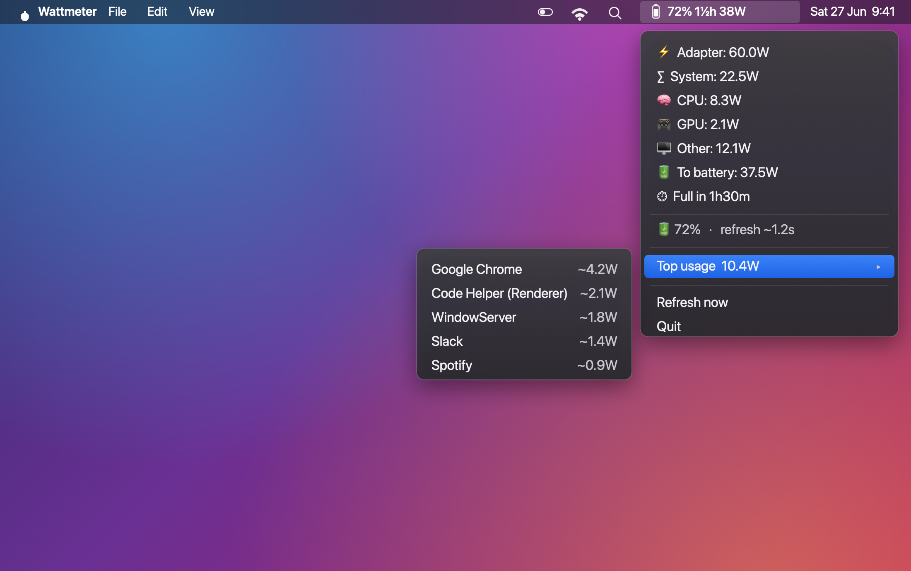

# Wattmeter — macOS menu-bar power monitor

A tiny macOS menu-bar app that shows, in real time, how many watts your Mac is
pulling or pushing: charging / discharging power, battery % and time
to-full / to-empty, and a **CPU / GPU / Other** breakdown with the top
energy-using apps.

It reads the Apple SMC sensors and the private IOReport framework directly, so
the numbers are real-time (≈1 s) and **no `sudo`** is ever needed.



## What it shows

The menu-bar title is the at-a-glance line — battery %, time remaining, and
watts in a fixed-width column so it doesn't jiggle as values change:

| State | Title |
| --- | --- |
| Charging | `72% 1½h 38W` — level, time-to-full, watts into the battery |
| On adapter, full | `100% 12W` — level and system draw |
| On battery | `64% 3⅓h 9W` — level, time-to-empty, system draw |

Click it for the full readout:

- **⚡ Adapter** — power coming in from the charger
- **∑ System** — total system draw (`Adapter = System + To battery`)
- **🧠 CPU / 🎮 GPU / 🖥 Other** — `System = CPU + GPU + Other`, so the numbers add up
- **🔋 To battery / Draining** — what's flowing in or out of the battery
- **⏱ Full in / Empty in** — time estimate
- **Status** — battery %, average refresh interval, and a Low Power Mode flag
- **Top usage ▸** — the top apps by energy impact, with watts normalised to
  real CPU+GPU power (display and peripherals stay in *Other*, not blamed on apps)

## How it works

The power model is single-source, so everything reconciles: `System` is the
SMC's `PSTR` rail, and it's split as `CPU + GPU + Other`. Per-process watts are
`top`'s energy-impact scores normalised to the measured CPU+GPU power.

| File | Source | Role |
| --- | --- | --- |
| `smc.go` | AppleSMC via IOKit (cgo) | Real-time watts — `PSTR` (system), `PDTR` (adapter), `PBAT` (battery) |
| `ioreport.go` | private IOReport framework (`dlopen`, group "Energy Model") | Apple Silicon CPU / GPU power |
| `battery.go` | `ioreg AppleSmartBattery` | state, level, time-to-full / -empty |
| `top.go` | `top -l 2` | per-process energy impact |
| `icon.go` | inline SVG (NSImage rasterises it) | the menu-bar battery template icon |
| `format.go` | — | fixed-width watt field, compact time strings |
| `app.go` / `menu.go` / `main.go` | `getlantern/systray` | tick loop, state, menu |

Notes from the trenches: ioreg's `PowerTelemetryData` is laggy (tens of
seconds) and wraps negatives as huge unsigned numbers — so power comes from
SMC/IOReport, and `ioreg` is used only for battery state. `top`'s POWER column
is a unitless "energy impact", not watts.

To save energy it backs off the refresh rate in macOS Low Power Mode (15 s
instead of 5 s) and re-runs `top` only every other tick.

## Requirements

- Apple Silicon Mac (the IOReport CPU/GPU split is Apple-Silicon-specific; on
  other Macs it falls back to anchoring against whole-system power)
- macOS 12+
- Go 1.26+ (only to build)

The only third-party dependency is `getlantern/systray`; SMC and IOReport are
reached through cgo, and `ioreg` / `top` through subprocesses.

## Build & run

```sh
./charging.sh           # builds (if needed) and runs
```

Or manually:

```sh
go build -o charging-app .
./charging-app

go test ./...           # unit tests for the pure logic
```

The app lives entirely in the menu bar — there's no Dock icon or window. Use
**Quit** from the menu to stop it.
